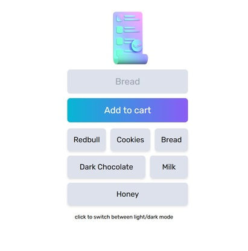
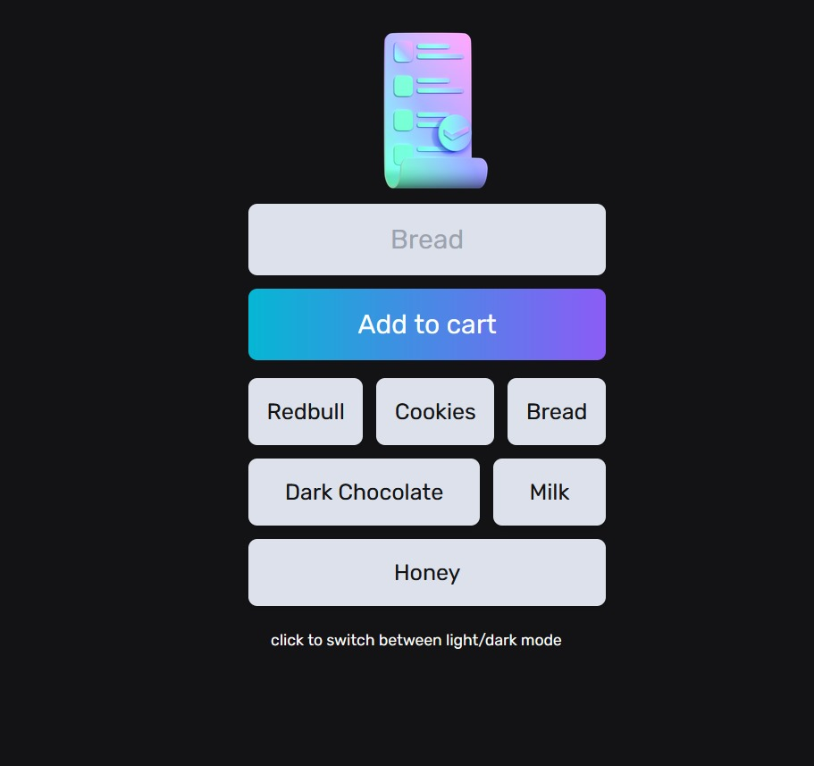

# Add to Cart App

Add to Cart App is a simple application designed to help users keep track of items they want to purchase. Whether shopping for groceries, household items, or anything else, this app allows you to easily add items to your cart and remove them when they're no longer needed.

## Features

- Add items to your cart to keep track of what you need to buy.
- Remove items from your cart when they're no longer needed.
- Real-time database powered by Firebase ensures your items are always synced and accessible from any device.
- Mobile-friendly design allows for seamless usage on both desktop and mobile devices.
- Can be installed as a Progressive Web App (PWA) for easy access from your device's home screen.
- Switch between light and dark mode for a personalized browsing experience.

## Technologies Used

- HTML
- CSS
- JavaScript
- Firebase (Real-time Database)

## Live Demo

Check out the live demo of the Add to Cart App [here](https://add-to-cart-app-dusky.vercel.app/).

## Screenshot

 

## How to Use

1. Simply visit the [live demo](https://add-to-cart-app-dusky.vercel.app/) link provided above.
2. Add items to your cart by typing them into the input field and pressing enter or clicking the add button.
3. To remove an item from your cart, click on the item you wish to remove.
4. Your cart will automatically sync in real-time so that you can access your items from any device.
5. Toggle between light and dark mode by clicking on the mode switcher.

## Feedback

If you have any feedback, suggestions, or issues with the Add to Cart App, please feel free to reach out.

Thank you for using the Add to Cart App! Happy shopping! 🛒🎉
